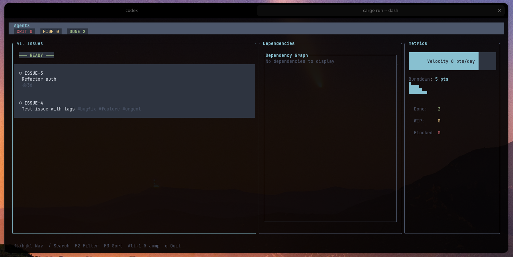

# AgentX

> **AI-native issue tracker** designed for developers who live in the terminal.

Fast, keyboard-driven issue tracking with dependency graphs, TUI dashboard, and MCP server integration.



---

## ✨ Features

### 🎯 Core Issue Management

- **Create & Track**: Issues with status, priority, effort estimates, tags, and dependencies
- **Smart Workflows**: Automatic state transitions (Backlog → Ready → In Progress → Done)
- **Quick Actions**: Bulk operations, checkpoints, context switching
- **Fuzzy Search**: Find issues by partial ID, title, or tags

### 📊 Visualization & Analytics

- **TUI Dashboard**: Full-screen interactive interface (Jira-style unified list)
- **Dependency Graphs**: ASCII art visualization of issue relationships
- **Critical Path**: Find bottlenecks in your dependency chain
- **Metrics**: Track completion rates, velocity, and burndown

### 🤖 AI Integration

- **MCP Server**: Expose issue tracker via Model Context Protocol
- **Agent-Friendly**: Structured data, JSON output, semantic operations
- **Context Awareness**: Focus on relevant issues, show what's blocked

### 🔧 Developer Experience

- **Git Integration**: Auto-detect branch context, commit references
- **Interactive Mode**: Guided wizards for complex operations
- **Shell Completions**: Bash, Zsh, Fish support
- **Zero Config**: Works out of the box, stores in `~/.local/share/agentx`

## 🎨 TUI Dashboard

The interactive dashboard provides a Jira-like experience in your terminal:

### Features

- ✅ **Unified List**: All issues in one scrollable view
- ✅ **Live Search**: Type `/` and start searching instantly
- ✅ **Status Dividers**: Clear visual separation between states
- ✅ **Priority Icons**: 🔴 Critical, 🟡 High, 🟢 Medium, ⚪ Low
- ✅ **Tag Display**: See all tags inline
- ✅ **Effort Estimates**: Track time commitments
- ✅ **Vim Keybindings**: `hjkl` navigation + search

---

## 🚀 Quick Start

### Installation

```bash
# Clone and build
git clone https://github.com/can1357/agentx.git
cd agentx
cargo build --release

# Install to PATH
cargo install --path .
```

### Create Your First Issue

```bash
# Quick create
agentx new "Fix authentication bug" -p high -e 2d -t bug -t security

# Interactive mode
agentx new -i
```

### Launch the TUI Dashboard

```bash
agentx ui
# or use the alias:
agentx dash
```

**Navigation:**

- `↑↓` or `jk` - Navigate issues
- `/` - Search (live results)
- `g`/`G` - Jump to top/bottom
- `PgUp`/`PgDn` - Scroll faster
- `Tab` - Switch panes
- `q` - Quit

---

## 📖 Command Reference

### Issue Lifecycle

```bash
# Create new issue
agentx new "Task description" [OPTIONS]
# or use the alias:
agentx add "Task description" [OPTIONS]
  -p, --priority <critical|high|medium|low>
  -e, --effort <duration>     # e.g., "2d", "4h", "1w"
  -t, --tag <tag>             # Can be used multiple times
  -d, --depends <ID>          # Add dependency
  -i, --interactive           # Launch wizard

# Update status
agentx start <ID>             # Mark as in-progress
agentx block <ID> <reason>    # Mark as blocked
agentx close <ID>             # Mark as done
agentx defer <ID>             # Move to backlog
agentx activate <ID>          # Activate from backlog

# View issues
agentx list                   # All open issues
# or use the alias:
agentx ls                     # All open issues
agentx show <ID>              # Full details
agentx context                # Current work context
agentx focus                  # Top priorities
agentx blocked                # All blocked issues
agentx ready                  # Ready to start
agentx quick-wins             # Low-effort tasks
```

### Dependencies

```bash
# Add dependency
agentx depend add <ID> <depends-on>

# Remove dependency
agentx depend remove <ID> <depends-on>

# Visualize graph
agentx deps-graph [ID]        # ASCII art
agentx dependencies <ID>      # Show deps + dependents

# Find bottlenecks
agentx critical-path          # Longest dependency chain
```

### Tags & Organization

```bash
# Add tags
agentx tag add <ID> <tag>

# Remove tags
agentx tag remove <ID> <tag>

# List by tag (in list command)
agentx list -t backend -t api
```

### Bulk Operations

```bash
# Start multiple issues
agentx bulk-start <ID1> <ID2> <ID3>

# Close multiple issues
agentx bulk-close <ID1> <ID2> <ID3>
```

### Analytics

```bash
# Show metrics
agentx metrics

# Recent changes
agentx summary

# Issue counts by status
agentx list --json | jq '.[] | .metadata.status' | sort | uniq -c
```

---

## 🔌 MCP Server

AgentX can run as an MCP server for AI assistant integration:

```bash
# Start server on stdio
agentx serve
```

### Available Tools

The MCP server exposes these operations to AI assistants:

| Tool             | Description                            |
| ---------------- | -------------------------------------- |
| `create_issue`   | Create new issue with metadata         |
| `list_issues`    | Query issues by status/priority/tags   |
| `update_issue`   | Change status, add tags, update fields |
| `show_issue`     | Get full details of specific issue     |
| `add_dependency` | Link issues together                   |
| `get_blocked`    | Find all blocked issues                |
| `get_ready`      | Find issues ready to start             |

### Example Claude Desktop Config

```json
{
  "mcpServers": {
    "agentx": {
      "command": "agentx",
      "args": ["serve"],
      "env": {}
    }
  }
}
```

---

## 🛠️ Advanced Usage

### Import from YAML

```bash
# Bulk import issues
agentx import issues.yaml
```

**Format:**

```yaml
issues:
  - title: "Setup CI/CD pipeline"
    priority: high
    effort: "1w"
    tags: ["devops", "infrastructure"]
    depends_on: []
  - title: "Write integration tests"
    priority: medium
    effort: "3d"
    tags: ["testing"]
    depends_on: ["BUG-123"]
```

### Alias Management

```bash
# Create short aliases for long IDs
agentx alias add auth BUG-123
agentx show auth              # Same as: agentx show BUG-123

# List aliases
agentx alias list
```

### Checkpoints

Track progress within a single issue:

```bash
# Add checkpoint
agentx checkpoint BUG-123 "Completed database migration"
agentx checkpoint BUG-123 "Updated API endpoints"

# View in issue details
agentx show BUG-123
```

### JSON Output

All commands support JSON output for scripting:

```bash
# Get JSON output
agentx list --json | jq '.[] | select(.metadata.priority == "Critical")'

# Count issues by status
agentx list --json | jq 'group_by(.metadata.status) | map({status: .[0].metadata.status, count: length})'
```

---

## 📁 Project Structure

```
agentx/
├── src/
│   ├── main.rs           # CLI entrypoint
│   ├── issue.rs          # Core issue types
│   ├── storage.rs        # File-based persistence
│   ├── commands/         # CLI commands
│   ├── tui/              # Dashboard UI
│   │   ├── mod.rs        # App state & event loop
│   │   ├── widgets/      # Kanban, graphs, charts
│   │   └── views/        # Dashboard layout
│   ├── mcp/              # MCP server
│   └── utils/            # Helpers
├── data/                 # Issue storage (auto-created)
├── Cargo.toml
└── README.md
```

**Data Location:** `~/.local/share/agentx/`

---

## 🎯 Workflow Examples

### Daily Workflow

```bash
# Morning: Check context
agentx focus                  # What's important today?
agentx context                # What am I working on?

# Start working
agentx start BUG-123
agentx checkpoint BUG-123 "Initial investigation complete"

# Found blocker
agentx block BUG-123 "Waiting for DB migration approval"

# Switch to quick win
agentx quick-wins
agentx start DOC-45

# End of day
agentx close DOC-45
agentx summary                # What did I accomplish?
```

### Planning a Feature

```bash
# Create feature breakdown
agentx new "API authentication layer" -p high -e 2w -t api
agentx new "Add JWT token generation" -p high -e 3d -t api -d FEA-100
agentx new "Implement token refresh" -p medium -e 2d -t api -d FEA-101
agentx new "Add rate limiting" -p low -e 1d -t api -d FEA-101

# Visualize dependencies
agentx deps-graph FEA-100

# Find critical path
agentx critical-path
```

### Bug Triage

```bash
# Import bugs from file
agentx import bugs.yaml

# Review critical issues
agentx list -p critical

# Launch dashboard for triage
agentx dash

# (In dashboard: use / to search, mark priorities)
```

---

## 🔧 Configuration

AgentX uses sensible defaults but can be customized:

```bash
# Initialize config
agentx init

# Location: ~/.config/agentx/config.yaml
```

**Example config.yaml:**

```yaml
# Issue ID format
id_prefix: "TASK"
id_start: 1

# Default values
defaults:
  priority: medium
  effort: null
  tags: []

# TUI theme
theme:
  name: "default"
```

---

## 🧪 Testing

```bash
# Run tests
cargo test

# Run with logging
RUST_LOG=debug agentx dash

# Check performance
hyperfine 'agentx list'
```

---

## 📜 License

MIT License - see LICENSE file for details.
